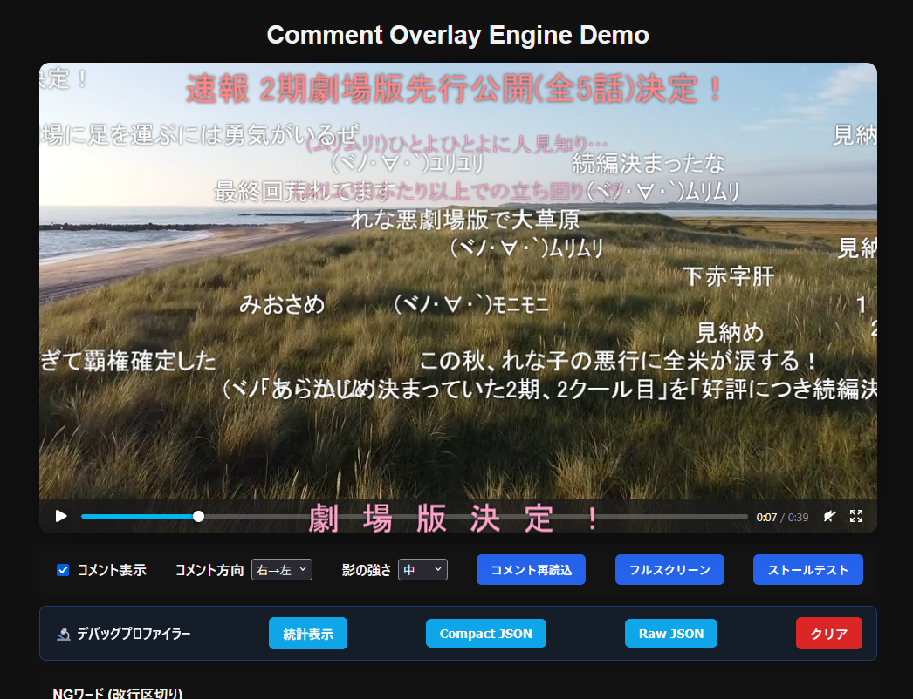

# comment-overlay

[](https://www.npmjs.com/package/comment-overlay)
[](https://www.npmjs.com/package/comment-overlay)
[](./LICENSE)

再利用可能なコメントオーバーレイ描画エンジンです。ニコニコ動画のような横流れコメントを、HTML5 動画など任意の再生コンテンツ上に重ねて表示できます。npm モジュールとして公開されており、`npm install comment-overlay` で導入できます。



## 開発に必要な環境

- Node.js 20.x
- npm 10 以降

## 開発環境のセットアップ

```bash
npm install
```

## スクリプト

- `npm run dev`: Vite 開発サーバーを起動します。
- `npm run build`: 出力をクリーンアップして型定義を生成した後、ライブラリをビルドします。
- `npm run lint`: `src` ディレクトリの TypeScript ファイルを ESLint で検査します。
- `npm run type-check`: `tsconfig.build.json` を用いた型チェックを実行します。
- `npm run serve`: `overlay-tests` ディレクトリを静的サーバーで起動し、ビルド成果物を使って動作確認できます。

開発にあたり、変更後は `npm run lint`、`npm run type-check`、`npm run build` を順番に実行して品質を確認してください。

## 使い方

ライブラリは `CommentRenderer` を中心に構成されています。以下は動画要素にコメントを重ねる最小限の例です。

```ts
import {
  CommentRenderer,
  cloneDefaultSettings,
  type RendererSettings,
} from "comment-overlay";

const video = document.querySelector("video");
const container = document.querySelector(".overlay-container");

if (!(video instanceof HTMLVideoElement) || !(container instanceof HTMLElement)) {
  throw new Error("動画要素または描画コンテナが見つかりません。");
}

const settings: RendererSettings = cloneDefaultSettings();
const renderer = new CommentRenderer(settings, {
  loggerNamespace: "MyOverlay",
});

renderer.initialize({ video, container });
renderer.addComment("このコメントは明朝体で赤色で下部に大きく表示されます", 500, ["shita", "red", "big", "mincho"]);

// 動画のライフサイクルに合わせてリソースを解放します。
video.addEventListener("ended", () => {
  renderer.destroy();
});
```

対応コメントコマンドは以下の通りです。
- 位置指定: `shita`, `ue`, `naka`
- サイズ指定: `small`, `medium`, `big`
- フォント指定: `defont`(システムフォント), `gothic`(ゴシック体), `mincho`(明朝体)
- 色指定: `white`, `red`, `pink`, `orange`, `yellow`, `green`, `cyan`, `blue`, `purple`, `black`, `white2`, `red2`, `pink2`, `orange2`, `yellow2`, `green2`, `cyan2`, `blue2`, `purple2`, `black2`
- 透明度指定: `_live`(半透明), `invisible`(非表示)
- 色指定: `#FF0000`, `#00FF00`, `#0000FF`などの16進数カラーコード
- 字間指定: `ls:10` や `letterspacing:10` (px単位)
- 行高指定: `lh:1.5` や `lineheight:150%` (倍率またはパーセント)
- コメントコマンドが未指定のときは`naka` `medium` `defont` `white` 相当の表示になります。

### RendererSettings のポイント

- `ngWords`: 入力テキストをトリムしたうえで部分一致 (大文字小文字を区別せず) による NG 判定を行います。
- `ngRegexps`: コメント本文に対して評価される正規表現文字列の配列です。空配列を渡すと無効になります。
- `scrollDirection`: `'rtl'` (右→左) または `'ltr'` (左→右) を指定して、横流れコメントの方向を切り替えられます。

### サンプルを試す

1. ライブラリをビルドします: `npm run build`
2. サンプルサーバーを起動します: `npm run serve`
3. ブラウザーで表示される URL を開き、`overlay-tests` 内のテスト UI でコメント描画を確認できます。

サンプル UI は `overlay-tests` ディレクトリにあり、`scripts/sync-overlay-tests.mjs` によってビルド成果物と同期されます。コメントデータは `overlay-tests/comments.json` を編集して調整できます。動画データは `overlay-tests/video.mp4` と `overlay-tests/video2.mp4` に配置してください。UI からは NG ワード/NG 正規表現の有効化とスクロール方向の切り替えをリアルタイムで試せます。

より詳細なセットアップや API の使い方は [DOCUMENTATION.md](./DOCUMENTATION.md) を参照してください。

## コントリビューション

バグ報告や機能提案は GitHub Issue テンプレートを利用してください。Pull Request を送る際は、テンプレートのチェックリストに従ってローカルでの検証を済ませてから提出してください。

## ライセンス

このプロジェクトは [MIT License](./LICENSE) の下で提供されています。
