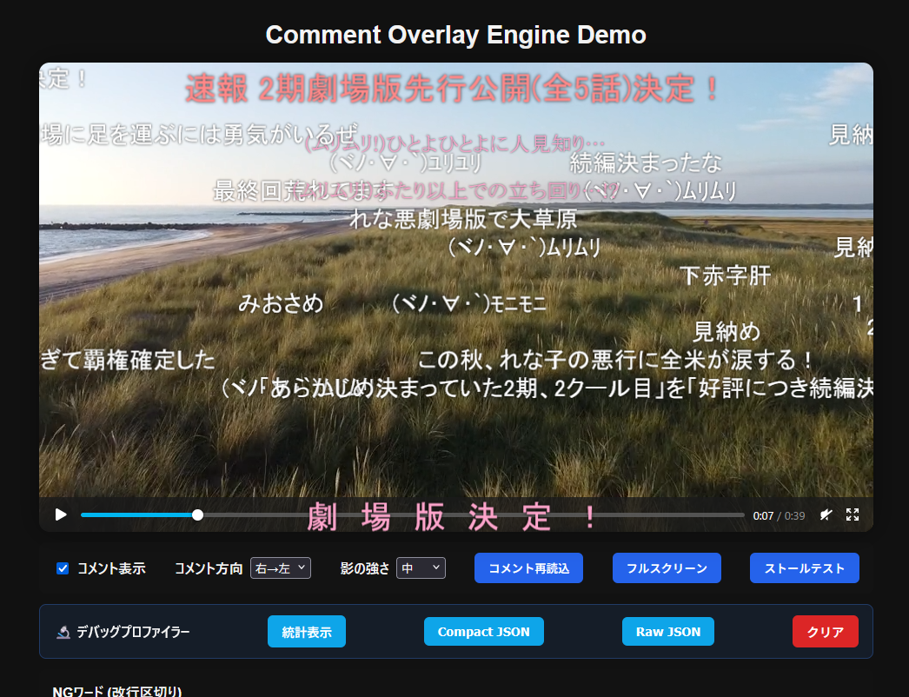

# comment-overlay

[](https://www.npmjs.com/package/comment-overlay)
[](https://www.npmjs.com/package/comment-overlay)
[](./LICENSE)

再利用可能なコメントオーバーレイ描画エンジンです。ニコニコ動画のような横流れコメントを、HTML5 動画など任意の再生コンテンツ上に重ねて表示できます。npm レジストリで公開されており、`bun add comment-overlay` で導入できます。



## NPM パッケージ

- [comment-overlay](https://www.npmjs.com/package/comment-overlay)


## 開発に必要な環境

- Bun 1.3.8 以降

## 開発環境のセットアップ

```bash
bun install
```

## スクリプト

- `bun run dev`: Vite 開発サーバーを起動します。
- `bun run build`: 出力をクリーンアップして型定義を生成した後、ライブラリをビルドします。
- `bun run lint`: `src` ディレクトリの TypeScript ファイルを ESLint で検査します。
- `bun run type-check`: `tsconfig.build.json` を用いた型チェックを実行します。
- `bun run serve`: `overlay-tests` ディレクトリを静的サーバーで起動し、ビルド成果物を使って動作確認できます。
- `bun run nico:trace -- ...`: CDP 接続した Chrome 上のニコニコ動画プレイヤーから Canvas 描画ログとスクリーンショットを採取します。
- `bun run nico:overlay-trace -- ...`: 生コメントJSONを `comment-overlay` で描画し、校正トレースを採取します。
- `bun run nico:report -- ...`: 実プレイヤー採取ログと `comment-overlay` 側ログの差分レポートを生成します。
- `bun run nico:strict-score -- ...`: 実プレイヤーと `comment-overlay` の `drawImage` 外側レイヤー位置を数値比較します。
- `bun run nico:internal-score -- ...`: 実プレイヤーと `comment-overlay` のソースキャンバス内部 `fillText` 配置を数値比較します。

開発にあたり、変更後は `bun run lint`、`bun run type-check`、`bun run build` を順番に実行して品質を確認してください。

## パブリッシュ手順（メンテナー向け）

このプロジェクトはGitHub Actionsを使用してnpmに自動パブリッシュします。npmは2025年12月9日にクラシックトークンを無効化したため、新しいグラニュラートークンを使用します。

### 初回セットアップ

1. npmで新しいグラニュラートークンを作成
   - https://www.npmjs.com/settings/[your-username]/tokens にアクセス
   - "Generate New Token" → "Granular Access Token"を選択
   - Permissions: "Read and write"を付与
   - Packages: "All packages"または`comment-overlay`を選択
   - "Automation"オプションを有効化（2FAバイパス用）

2. GitHubリポジトリのSecretsに追加
   - Settings → Secrets and variables → Actions → New repository secret
   - Name: `NPM_TOKEN`
   - Value: 作成したnpmトークンを貼り付け

### パッケージのパブリッシュ

1. `package.json`のバージョンを更新（例: 2.9.0 → 2.10.0）
2. `src/config/default-settings.ts`のバージョンも更新
3. 変更をコミット＆プッシュ
4. タグを作成してプッシュ:
   ```bash
   git tag v2.10.0
   git push origin v2.10.0
   ```
5. GitHub Actionsが自動的に実行され、npmにパブリッシュされます

または、GitHubの"Actions"タブから"Publish to npm"ワークフローを手動実行することもできます。

## 非推奨バージョン

次のバージョンはバグを含むため非推奨となっています:v1.2.0, v1.2.1, v1.2.2, v2.5.0

## 使い方

ライブラリは `CommentRenderer` を中心に構成されています。以下は動画要素にコメントを重ねる最小限の例です。

```ts
import {
  CommentRenderer,
  cloneDefaultSettings,
  type RendererSettings,
} from "comment-overlay";

const video = document.querySelector("video");
const container = document.querySelector(".overlay-container");

if (!(video instanceof HTMLVideoElement) || !(container instanceof HTMLElement)) {
  throw new Error("動画要素または描画コンテナが見つかりません。");
}

const settings: RendererSettings = cloneDefaultSettings();
const renderer = new CommentRenderer(settings, {
  loggerNamespace: "MyOverlay",
});

renderer.initialize({ video, container });
renderer.addComment(
  "このコメントは明朝体で赤色で下部に大きく表示されます",
  5000,
  ["shita", "red", "big", "mincho"],
);

// 動画のライフサイクルに合わせてリソースを解放します。
video.addEventListener("ended", () => {
  renderer.destroy();
});
```

フルスクリーン表示でもコメントを重ねる場合は、`video.requestFullscreen()` ではなく、`renderer.initialize({ video, container })` に渡したオーバーレイコンテナへ `container.requestFullscreen()` を呼び出してください。レンダラーはフルスクリーン変更時にキャンバスをコンテナへ追従させ、動画より前面に配置します。

第2引数 `vposMs` はコメントを表示するミリ秒単位の再生位置です。

校正用途では `renderer.addComment(text, vposMs, commands, meta)` の第4引数に `no`、`fork`、`source`、`threadId`、`date`、`userIdHash` を渡せます。これらは描画挙動には影響せず、重複判定と校正 trace / frame snapshot のコメント同一性復元に使用されます。

対応コメントコマンドは以下の通りです。
- 位置指定: `shita`, `ue`, `naka`
- サイズ指定: `small`, `medium`, `big`
- フォント指定: `defont`(システムフォント), `gothic`(ゴシック体), `mincho`(明朝体)
- 色指定: `white`, `red`, `pink`, `orange`, `yellow`, `green`, `cyan`, `blue`, `purple`, `black`, `white2`, `red2`, `pink2`, `orange2`, `yellow2`, `green2`, `cyan2`, `blue2`, `purple2`, `black2`
- 透明度指定: `_live`(半透明), `invisible`(非表示)
- スクロール幅指定: `full`(横流れコメントの幅に応じた表示時間短縮を行わない)
- 色指定: `#FF0000`, `#00FF00`, `#0000FF`などの16進数カラーコード
- 字間指定: `ls:10` や `letterspacing:10` (px単位)
- 行高指定: `lh:1.5` や `lineheight:150%` (倍率またはパーセント)
- コメントコマンドが未指定のときは`naka` `medium` `defont` `white` 相当の表示になります。

`small` / `medium` / `big` のフォント比率、`gothic` のフォント候補、多行スクロールコメントの内部テクスチャ寸法は、ニコニコ動画実プレイヤーの Canvas 描画ログに基づいて調整しています。v4.0.0 では通常 `naka` コメントのレーン投入を、同一 `vposMs` では `no` 昇順、上レーン優先、同一レーン再利用条件 `dt >= max(width / speed)` の公式観測式へ更新しました。`ca` コマンドは専用描画経路を持たず、通常コメントと同じレンダリングパイプラインで処理されます。

### RendererSettings のポイント

- `ngWords`: 入力テキストをトリムしたうえで部分一致 (大文字小文字を区別せず) による NG 判定を行います。
- `ngRegexps`: コメント本文に対して評価される正規表現文字列の配列です。空配列を渡すと無効になります。
- `scrollDirection`: `'rtl'` (右→左) または `'ltr'` (左→右) を指定して、横流れコメントの方向を切り替えられます。

### コメントテキストの処理に関する注意

コメントデータを処理する際、**`.trim()` を使用しないでください**。`.trim()` は全角スペース（`\u3000`）や非破壊スペース（`\u00A0`）を削除するため、AAコメント（アスキーアート）のインデント構造が崩れる原因となります。

```ts
// ❌ 悪い例
const text = commentData.body.trim();
renderer.addComment(text, vposMs, commands);

// ✅ 良い例
const text = commentData.body;
if (text.length > 0) {
  renderer.addComment(text, vposMs, commands);
}
```

### コメント表示/非表示の切り替え (v3.0.0+)

コメントの表示/非表示を動的に切り替えるには `setCommentVisibility()` メソッドを使用します。

```ts
// コメントを非表示にする（即座にキャンバスがクリアされる）
renderer.setCommentVisibility(false);

// コメントを再表示する（描画が再開される）
renderer.setCommentVisibility(true);
```

**注意:** `renderer.settings.isCommentVisible = false` のように直接設定を変更すると、キャンバスがクリアされずコメントがフリーズした状態になります。必ず `setCommentVisibility()` メソッドを使用してください。

### イベントフック (v2.4.2+)

ライブラリは、エポック変更や内部状態の変化をイベントフック経由で通知できます。

```ts
import {
  CommentRenderer,
  cloneDefaultSettings,
  type CommentRendererEventHooks,
  type EpochChangeInfo,
  type RendererStateSnapshot,
} from "comment-overlay";

const eventHooks: CommentRendererEventHooks = {
  onEpochChange: (info: EpochChangeInfo) => {
    console.log(`エポック変更: ${info.previousEpochId} → ${info.newEpochId} (${info.reason})`);
  },
  onStateSnapshot: (snapshot: RendererStateSnapshot) => {
    console.log("状態スナップショット:", snapshot);
  },
};

const renderer = new CommentRenderer(cloneDefaultSettings(), {
  loggerNamespace: "MyOverlay",
  eventHooks,
  debug: {
    enabled: true, // デバッグログを有効化
  },
});
```

**エポック変更のタイミング:**
- `source-change`: 動画ソースが変更されたとき
- `metadata-loaded`: 動画のメタデータがロードされたとき

デバッグログを有効にすると、内部状態の変化がコンソールに出力されます。

### サンプルを試す

1. ライブラリをビルドします: `bun run build`
2. サンプルサーバーを起動します: `bun run serve`
3. ブラウザーで表示される URL を開き、`overlay-tests` 内のテスト UI でコメント描画を確認できます。

サンプル UI は `overlay-tests` ディレクトリにあり、`scripts/sync-overlay-tests.mjs` によってビルド成果物と同期されます。コメントデータと動画データは `overlay-tests/fixtures/` に配置してください。`overlay-tests/fixtures/sm6240144.mp4` と `overlay-tests/fixtures/sm6240144-comments.json` がローカルにある場合は、`http://127.0.0.1:4173/?preset=cat-mario` または UI の `sm6240144 猫マリオCA` preset で 01:40 付近のコメントアート確認を開始できます。これらの `sm6240144` 用アセットはgit管理対象外です。UI からは NG ワード/NG 正規表現の有効化とスクロール方向の切り替えをリアルタイムで試せます。


## コントリビューション

バグ報告や機能提案は GitHub Issue テンプレートを利用してください。Pull Request を送る際は、テンプレートのチェックリストに従ってローカルでの検証を済ませてから提出してください。

## ライセンス

このプロジェクトは [MIT License](./LICENSE) の下で提供されています。
